<div align="center">

# 📦 MM12 Estoque

**Controle de estoque com autenticação, perfis de acesso e trilha de auditoria de movimentações.**

Desafio técnico do processo seletivo da **MM12** — construído em 2021 e modernizado em 2026.

[](https://github.com/Bizzye/MM12Desafio/actions/workflows/ci.yml)
[](https://github.com/Bizzye/MM12Desafio/actions/workflows/codeql.yml)


[](https://github.com/Bizzye/MM12Desafio/actions/workflows/android.yml)


[**🧪 Demo online**](https://bizzye.github.io/MM12Desafio/) · [**📱 Baixar APK**](https://github.com/Bizzye/MM12Desafio/releases/latest/download/mm12-estoque.apk) · [**🚀 Produção**](https://desafio564.web.app) · [**🔍 Code review**](docs/CODE_REVIEW.md)

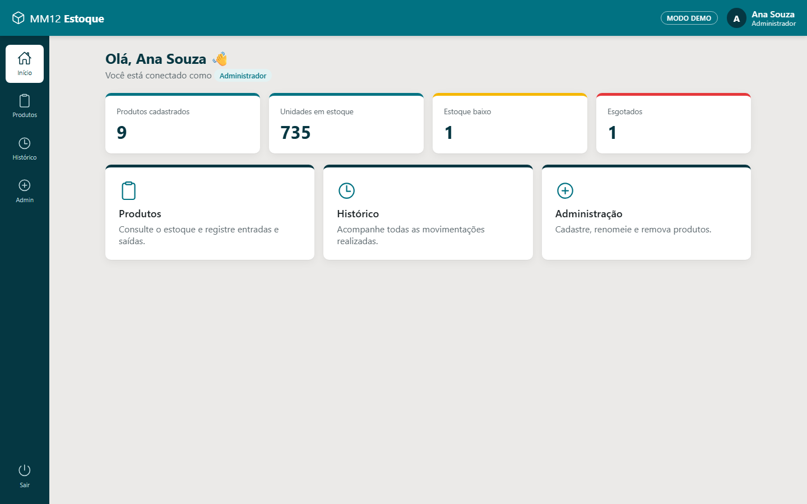

</div>

---

## 📋 Sumário

- [Sobre o desafio](#-sobre-o-desafio)
- [Experimente](#-experimente)
- [Telas](#-telas)
- [Funcionalidades](#-funcionalidades)
- [Stack](#-stack)
- [Arquitetura](#-arquitetura)
- [Segurança](#-segurança)
- [Qualidade e testes](#-qualidade-e-testes)
- [Como rodar localmente](#-como-rodar-localmente)
- [CI/CD](#-cicd)
- [Antes × depois](#-antes--depois)

## 🎯 Sobre o desafio

O teste pedia uma aplicação de **controle de estoque** em Ionic/Angular com Firebase, contendo:

- Login com e-mail e senha;
- Dois perfis de acesso — **Administrador** e **Estoquista**;
- Cadastro, edição e remoção de produtos (somente administrador);
- Registro de **entradas** e **saídas** de estoque, com motivo na saída;
- **Histórico** de todas as movimentações.

A versão original (2021) atendia aos requisitos, mas acumulava dívidas técnicas e falhas de segurança. Em 2026 o projeto foi **reescrito para Angular 22**, ganhou testes, CI/CD e uma revisão completa de código — documentada em [`docs/CODE_REVIEW.md`](docs/CODE_REVIEW.md).

## 🧪 Experimente

|                 | Link                                                                                                         | Dados                                                 |
| --------------- | ------------------------------------------------------------------------------------------------------------ | ----------------------------------------------------- |
| **Demo**        | [bizzye.github.io/MM12Desafio](https://bizzye.github.io/MM12Desafio/)                                        | Fictícios, em memória — nada é salvo ao fechar a aba  |
| **App Android** | [Baixar `mm12-estoque.apk`](https://github.com/Bizzye/MM12Desafio/releases/latest/download/mm12-estoque.apk) | Mesmo modo demo, empacotado com Capacitor             |
| **Produção**    | [desafio564.web.app](https://desafio564.web.app)                                                             | Firebase (Auth + Firestore) — requer conta cadastrada |

> **Instalando o APK:** baixe no celular, abra o arquivo e permita "instalar apps de fontes desconhecidas" quando o Android pedir. Requer Android 7.0+. Todas as versões ficam em [Releases](https://github.com/Bizzye/MM12Desafio/releases).

Contas do modo demo (também disponíveis com um clique na tela de login):

| Perfil        | E-mail              | Senha      |
| ------------- | ------------------- | ---------- |
| Administrador | `admin@mm12.demo`   | `demo1234` |
| Estoquista    | `estoque@mm12.demo` | `demo1234` |

## 🖼️ Telas

<table>
  <tr>
    <td width="50%">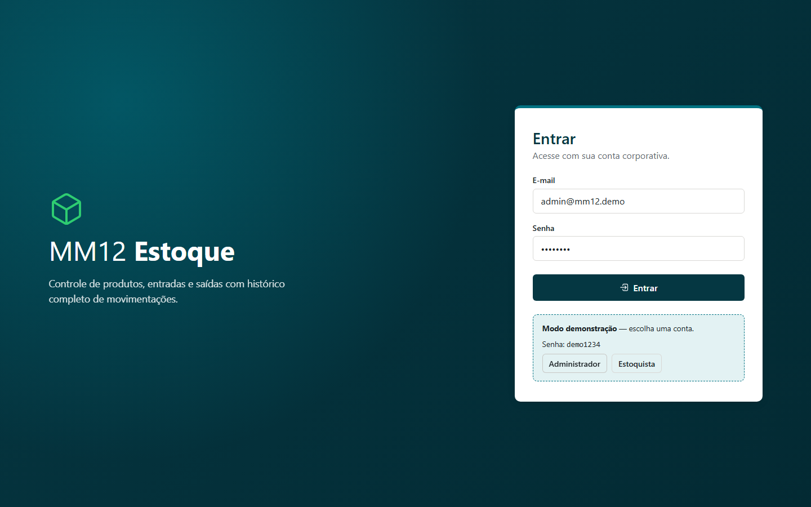<p align="center"><b>Login</b> — com atalhos para as contas de demonstração</p></td>
    <td width="50%"><p align="center"><b>Início</b> — resumo do estoque e atalhos por perfil</p></td>
  </tr>
  <tr>
    <td>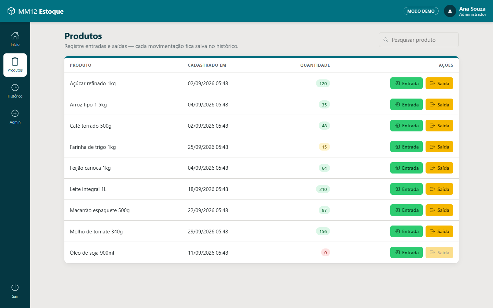<p align="center"><b>Produtos</b> — busca sem acentos, indicador de nível de estoque</p></td>
    <td>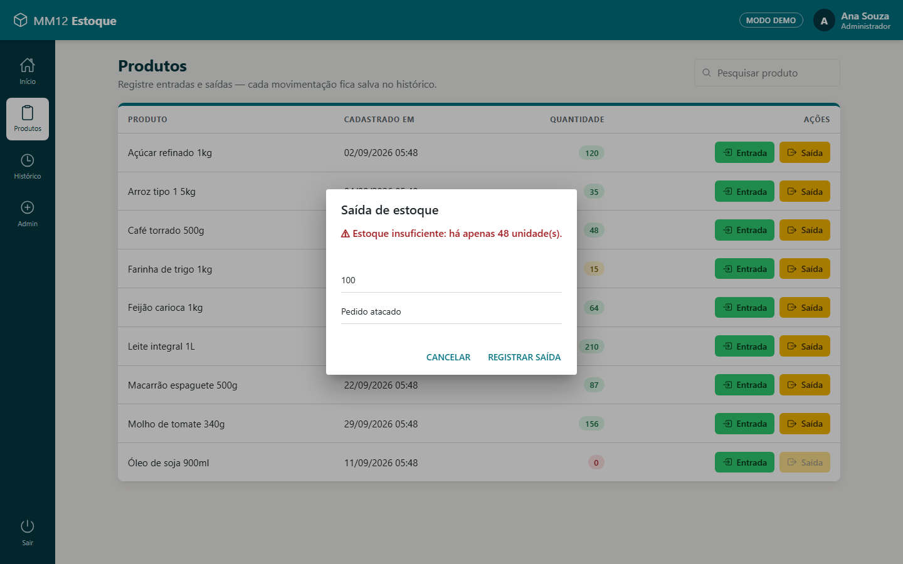<p align="center"><b>Saída</b> — validação impede saldo negativo</p></td>
  </tr>
  <tr>
    <td>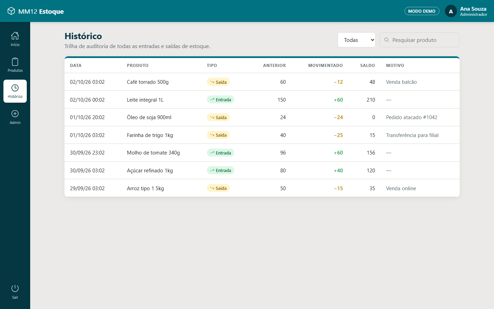<p align="center"><b>Histórico</b> — trilha de auditoria filtrável</p></td>
    <td>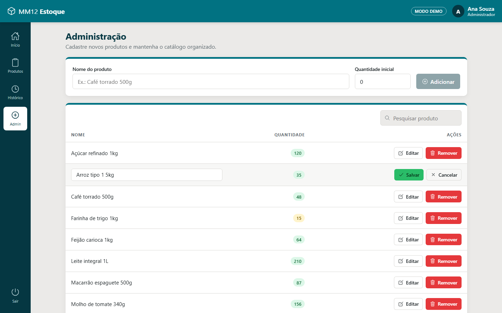<p align="center"><b>Administração</b> — cadastro e edição por linha</p></td>
  </tr>
</table>

<p align="center">
  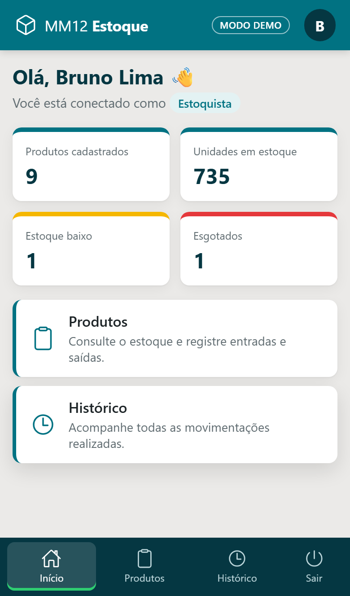
  &nbsp;&nbsp;
  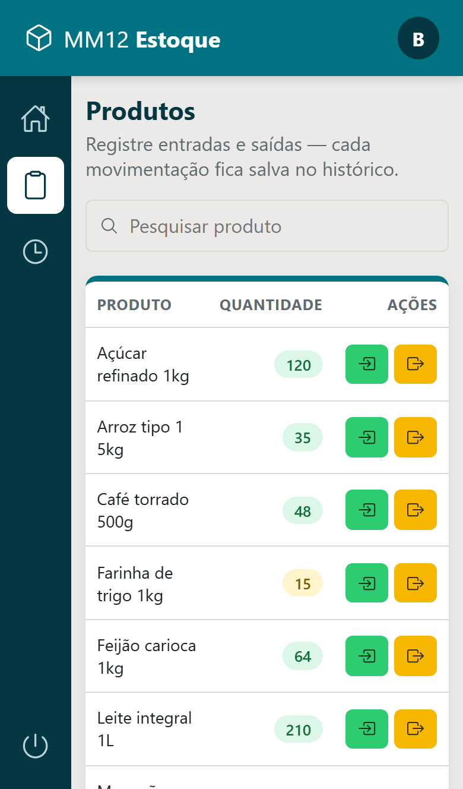
  &nbsp;&nbsp;
  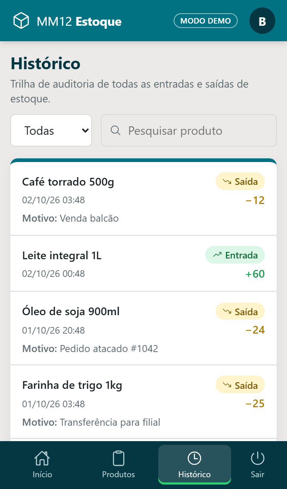
  <br /><b>Mobile</b> — barra de abas inferior e tabelas que viram listas de cards
</p>

> As imagens são geradas automaticamente pelo Playwright (`npm run screenshots`) a partir do modo demo.

## ✨ Funcionalidades

- 🔐 **Autenticação** com Firebase Auth e sessão persistente; mensagens de erro que não revelam se o e-mail existe.
- 👥 **Perfis de acesso** — estoquista movimenta estoque; administrador também gerencia o catálogo. Garantido por _guards_ na UI **e** por regras no Firestore.
- 📦 **Produtos** em tempo real com busca que ignora acentos e maiúsculas e badges de “Em estoque / Estoque baixo / Esgotado”.
- 🔁 **Entradas e saídas atômicas** — saldo recalculado em transação no servidor; saída exige motivo e não permite estoque negativo.
- 🕓 **Histórico imutável** com filtros por tipo e produto.
- 📊 **Painel inicial** com totais de produtos, unidades, itens em baixa e esgotados.
- 📱 **Mobile first-class**: barra de abas inferior, listas em cards e botões em largura total; **acessível** (teclado, labels, `aria-*`, contraste).
- 🧪 **Modo demo** sem backend, usado também pelos testes E2E.

## 🛠️ Stack

| Camada    | Tecnologias                                                                                     |
| --------- | ----------------------------------------------------------------------------------------------- |
| Front-end | Angular 22 (standalone, signals, zoneless, control flow), Ionic 9, RxJS 7, SCSS                 |
| Mobile    | Capacitor 8 (Android, edge-to-edge com safe areas), APK assinado gerado no CI                   |
| Backend   | Firebase Authentication, Cloud Firestore, Firebase Hosting                                      |
| Testes    | Karma + Jasmine (unitários), Playwright (E2E desktop/mobile e screenshots)                      |
| Qualidade | ESLint 10 (`angular-eslint`, `typescript-eslint` strict, a11y), Prettier, TypeScript 6 `strict` |
| CI/CD     | GitHub Actions, Firebase Hosting, GitHub Pages, GitHub Releases (APK), CodeQL, Dependabot       |

## 🏛️ Arquitetura

A aplicação segue **Ports & Adapters**: componentes e serviços dependem de **repositórios abstratos**; a implementação concreta (Firebase ou memória) é escolhida no _build_ por `fileReplacements`, então o bundle de demo não carrega nenhum código do Firebase.

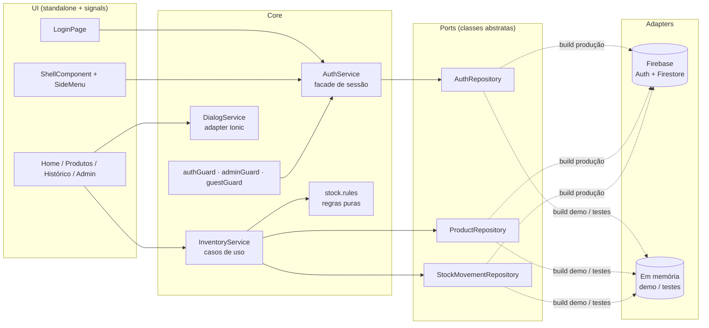

**Padrões aplicados**

| Padrão                        | Onde                                                                                            |
| ----------------------------- | ----------------------------------------------------------------------------------------------- |
| Repository / Ports & Adapters | `core/repositories/*` + `core/infra/firebase/*` e `core/infra/in-memory/*`                      |
| Facade                        | `AuthService` (sessão + navegação) e `InventoryService` (casos de uso de estoque)               |
| Adapter                       | `DialogService` sobre `AlertController`/`ToastController`; `rx-firestore.ts` (callbacks → RxJS) |
| Data Mapper                   | `firestore.mappers.ts` — schema legado em português ↔ modelo de domínio                         |
| Factory                       | `guard()` em `auth.guards.ts` gera os três guards; `createDemoSeed()`                           |
| Strategy                      | `AppTitleStrategy` (títulos de página), `IonicRouteStrategy`                                    |
| Dependency Injection / Tokens | `FIRESTORE`, `FIREBASE_AUTH`, `DEMO_SEED`, `DEMO_LOGIN_HINT`, `DEMO_SESSION_STORAGE`            |

<details>
<summary><b>Estrutura de pastas</b></summary>

```text
src/
├── app/
│   ├── core/
│   │   ├── guards/            # authGuard, guestGuard, adminGuard
│   │   ├── infra/
│   │   │   ├── firebase/      # adapters Firebase, mappers, tokens
│   │   │   └── in-memory/     # adapters em memória + dados de demonstração
│   │   ├── models/            # Product, StockMovement, AppUser
│   │   ├── repositories/      # ports (classes abstratas)
│   │   ├── services/          # AuthService, InventoryService, DialogService, AppTitleStrategy
│   │   └── utils/             # regras de estoque, busca, erros
│   ├── features/              # login, home, products, history, admin (lazy)
│   └── shared/                # layout (shell + menu), stock-badge, ícones
├── environments/              # produção (Firebase) e demo
└── testing/                   # helpers de teste
e2e/                           # Playwright: fluxos + geração de screenshots
firestore.rules                # regras de segurança versionadas
```

</details>

<details>
<summary><b>Modelo de dados (Firestore)</b></summary>

O schema da v1 foi mantido para não exigir migração — os _mappers_ convertem para o modelo de domínio.

| Coleção         | Campos                                                                                                         |
| --------------- | -------------------------------------------------------------------------------------------------------------- |
| `users/{uid}`   | `nome`, `categoria` (`adm` \| `est`) — somente leitura no cliente                                              |
| `products/{id}` | `nome`, `qtd`, `dataC`                                                                                         |
| `history/{id}`  | `dataT`, `tipoT` (`Entrada` \| `Saída`), `uid`, `desc?`, `itemT { id, nome, qtdpassado, qtdMovimentado, qtd }` |

</details>

## 🔒 Segurança

- **Regras do Firestore versionadas** ([`firestore.rules`](firestore.rules)): perfil do usuário imutável pelo cliente, catálogo restrito a administradores, estoquista só altera `qtd` (nunca negativa), histórico _append-only_, em nome do próprio usuário e **consistente com o saldo do produto** na mesma transação (`get()`/`getAfter()`).
- **Transações** para movimentações — sem _lost updates_ entre usuários simultâneos.
- **Defesa em profundidade**: validação na UI → no `InventoryService` → na regra de domínio → nas regras do Firestore.
- **Sem enumeração de usuários** no login.
- **Cabeçalhos HTTP** no Hosting: CSP, HSTS, `X-Frame-Options`, `nosniff`, `Referrer-Policy`, `Permissions-Policy`.
- **Supply chain**: `npm audit` sem vulnerabilidades, Dependabot semanal e análise **CodeQL** (`security-extended`).

Detalhes, severidades e pendências recomendadas em [`docs/CODE_REVIEW.md`](docs/CODE_REVIEW.md).

## ✅ Qualidade e testes

| Verificação      | Ferramenta                              | Resultado                                         |
| ---------------- | --------------------------------------- | ------------------------------------------------- |
| Testes unitários | Karma + Jasmine (ChromeHeadless)        | **106 testes**, ~96% de linhas (mínimo 80% no CI) |
| Testes E2E       | Playwright                              | **12 cenários** × desktop + mobile                |
| Lint             | ESLint + angular-eslint                 | 0 problemas                                       |
| Formatação       | Prettier                                | verificada no CI                                  |
| Tipagem          | TypeScript `strict` + `strictTemplates` | diagnósticos estendidos tratados como erro        |

Os testes unitários cobrem regras de domínio, mappers do Firestore, repositórios, serviços, guards e todos os componentes. Os E2E exercitam login, controle de acesso por perfil, entrada/saída com validação, histórico, busca e o CRUD de administração.

## 💻 Como rodar localmente

**Pré-requisitos:** Node.js 24 (veja [`.nvmrc`](.nvmrc)) e npm.

```bash
git clone https://github.com/Bizzye/MM12Desafio.git
cd MM12Desafio
npm ci

# Modo demo (dados em memória, sem credenciais) → http://localhost:4200
npm run start:demo

# Modo Firebase (projeto desafio564)
npm start
```

| Script                   | Descrição                                         |
| ------------------------ | ------------------------------------------------- |
| `npm start`              | Servidor de desenvolvimento conectado ao Firebase |
| `npm run start:demo`     | Servidor de desenvolvimento com dados em memória  |
| `npm run build`          | Build de produção em `www/`                       |
| `npm run build:demo`     | Build do modo demo em `www-demo/`                 |
| `npm test`               | Testes unitários (Karma, modo _watch_)            |
| `npm run test:ci`        | Testes unitários _headless_ com cobertura         |
| `npm run e2e`            | Testes E2E (sobe o modo demo automaticamente)     |
| `npm run screenshots`    | Regenera as imagens de `docs/screenshots/`        |
| `npm run lint`           | ESLint                                            |
| `npm run format`         | Prettier                                          |
| `npm run android:sync`   | Build demo + `cap sync` para o projeto Android    |
| `npm run android:open`   | Abre o projeto no Android Studio                  |
| `npm run android:assets` | Regenera ícones e splash do Android               |

> Antes do primeiro `npm run e2e`, instale o navegador: `npx playwright install chromium`.

## 🚀 CI/CD

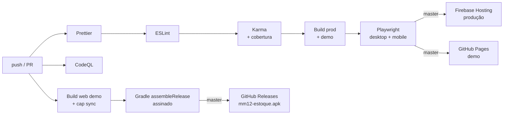

Workflows em [`.github/workflows`](.github/workflows). Para o deploy funcionar no seu fork:

1. **Firebase Hosting** — crie o secret `FIREBASE_SERVICE_ACCOUNT` com o JSON de uma conta de serviço (`firebase init hosting:github` gera automaticamente). Sem o secret, o job é ignorado com um aviso.
2. **GitHub Pages** — em _Settings → Pages_, selecione **GitHub Actions** como _source_.
3. **APK assinado** — secrets `ANDROID_KEYSTORE_BASE64`, `ANDROID_KEYSTORE_PASSWORD`, `ANDROID_KEY_ALIAS` e `ANDROID_KEY_PASSWORD`. Sem eles, o APK sai assinado com a chave de debug.
4. **Regras do Firestore** — `firebase deploy --only firestore:rules --project desafio564`.
5. **Contas e dados de produção** — secrets `SEED_ADMIN_EMAIL`, `SEED_ADMIN_PASSWORD`, `SEED_STOCKIST_EMAIL` e `SEED_STOCKIST_PASSWORD`; depois rode o workflow manual **Seed Firebase** ([`seed.yml`](.github/workflows/seed.yml)), que cria as contas, os perfis e um catálogo inicial.

## 🔄 Antes × depois

<table>
  <tr>
    <th>v1 — 2021</th>
    <th>v2 — 2026</th>
  </tr>
  <tr>
    <td>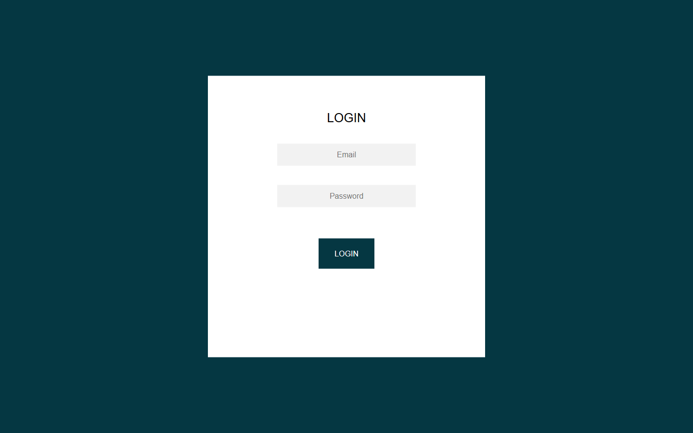</td>
    <td></td>
  </tr>
</table>

|                   | v1                                 | v2                                          |
| ----------------- | ---------------------------------- | ------------------------------------------- |
| Angular / Ionic   | 11 / 5 (NgModules)                 | 22 / 9 (standalone, signals, zoneless)      |
| Firebase          | 8 + AngularFire 6                  | 12 (SDK modular) atrás de repositórios      |
| Autorização       | apenas esconder links              | guards + regras do Firestore versionadas    |
| Movimentações     | 2 gravações independentes          | transação atômica                           |
| Testes            | specs do CLI quebrados             | 106 unitários + 12 E2E (desktop e mobile)   |
| Lint / formatação | ESLint padrão do CLI, sem Prettier | ESLint strict + a11y, Prettier, TS `strict` |
| CI/CD             | deploy manual                      | GitHub Actions + CodeQL + Dependabot        |
| Vulnerabilidades  | dependências fora de suporte       | `npm audit`: 0                              |

---

<div align="center">

Feito por **[Bizzye](https://github.com/Bizzye)**

</div>
